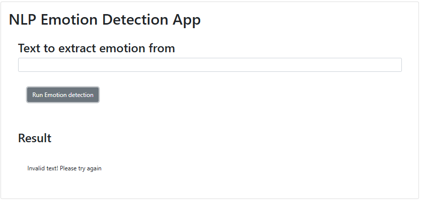
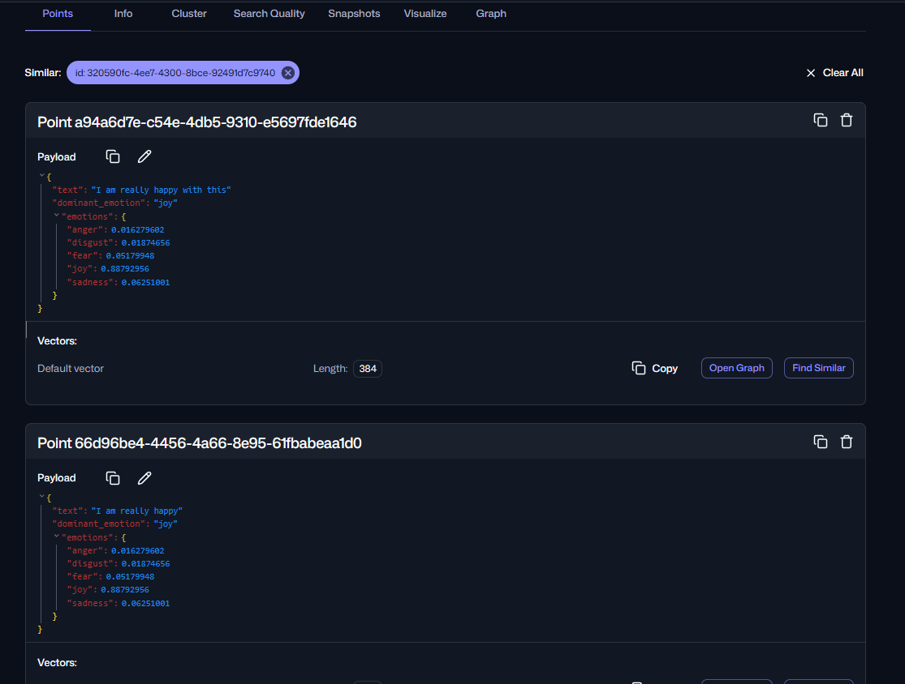

# Emotion Detection System
AI-Powered Emotion Analysis + Vector Search (Flask • Watson NLP • SentenceTransformers • Qdrant • Docker)


## 🚀 Project Overview
This project is a fully containerised AI microservice that:
* Detects fine-grained emotions (joy, anger, sadness, disgust, fear) from customer feedback using Watson NLP
* Embeds feedback using SentenceTransformers
* Stores embeddings + metadata in a Qdrant vector database
* Supports semantic search to find similar feedback
* Exposes a clean REST API via Flask
* Runs locally using Docker + Docker Compose (AI sandbox pattern)

This end-to-end system demonstrates practical skills in:
* NLP
* Vector databases
* API design
* Dockerised microservices
* Semantic search
* Error handling & testing
* Monitoring/debugging with Qdrant UI

⸻

## 🛠 Tech Stack
* **Backend**: Python, Flask
* **AI/NLP**: Watson NLP, SentenceTransformers
* **Vector DB**: Qdrant (Dockerised)
* **Search**: Cosine similarity
* **DevOps**: Docker, Docker Compose, Pylint
* **Frontend**: HTML, JavaScript (basic UI)

⸻

## ⚡ Quickstart (Docker — recommended)
```bash
docker-compose up --build
```
* App → http://localhost:5000
* Qdrant Dashboard → http://localhost:6333

Stops everything:
```bash
docker-compose down
```

⸻

## 🧠 Architecture Overview
```
User Input → Flask API → Watson NLP emotion detection 
           → SentenceTransformer embeddings → Qdrant vector DB
           → Semantic search → Flask response → UI
```

**Components:**
* **server.py** – Flask API (analysis, storage, semantic search, health, count)
* **emotion_detection.py** – Watson NLP integration
* **embeddings.py** – embedding + Qdrant client + similarity search + count
* **docker-compose.yml** – Orchestrates Flask + Qdrant services
* **Qdrant Dashboard** – Real-time inspection of vectors & payloads

⸻

## 📡 API Endpoints
**POST /api/analyse_and_store**

Analyse text + store in Qdrant.
```bash
curl -X POST http://localhost:5000/api/analyse_and_store \
-H "Content-Type: application/json" \
-d "{\"text\": \"I am really happy with this service\"}"
```
**Response:**
```bash
{
  "text": "I am really happy with this service",
  "analysis": {
    "anger": 0.016,
    "disgust": 0.018,
    "fear": 0.052,
    "joy": 0.888,
    "sadness": 0.062,
    "dominant_emotion": "joy"
  }
}
```

⸻

**GET /api/search_feedback?query=…**

Semantic search using vector similarity.
```bash
curl "http://localhost:5000/api/search_feedback?query=I%20am%20so%20angry"
```
Returns closest matches with similarity scores + emotions.

⸻

**GET /status**

Simple health check.
```bash
{"status": "ok"}
```

⸻

**GET /count**

Returns number of stored feedback items.

⸻

## 🧬 Emotion Detection (Watson NLP)
1. Calls Watson NLP API
2. Extracts emotion probabilities
3. Identifies dominant emotion
4. Returns a structured JSON response

Example output:
```bash
{
 "anger": 0.01,
 "disgust": 0.02,
 "fear": 0.05,
 "joy": 0.93,
 "sadness": 0.04,
 "dominant_emotion": "joy"
}
```

⸻

## 🔍 Semantic Search (Qdrant + Embeddings)

### Why Qdrant?
Qdrant is a purpose-built vector database designed for fast similarity search.

### How storing works
* Convert text → vector (SentenceTransformer)
* Generate unique ID (uuid4)
* Store vector + metadata payload in Qdrant
* Payload includes both:
    * the raw text
    * the Watson emotion scores

### How searching works
* Convert query → vector
* Perform cosine similarity search
* Retrieve top-k matches with payloads

This enables “find similar feedback” based purely on semantics.

⸻

## 🐳 Dockerisation

### Dockerfile
* Python 3.10-slim
* Install dependencies
* Copy source code
* Expose port 5000
* Run Flask server

## docker-compose.yml
Defines two services:
```yaml
services:
  emotion-detection:  # Flask API
  qdrant:             # Vector database
```
* Shared Docker network
* Persistent volume (qdrant_data)
* Automatic rebuild/run using one command

⸻

## 🧪 Testing & Code Quality

### Unit Tests
Located in `test_emotion_detection.py`.

Run:
```bash
python -m unittest
```

### Static Analysis (Pylint)
Run:
```bash
pylint server.py
```

⸻

## 🖥 Debugging (with Docker)
Run app service in foreground:
```bash
docker-compose run --service-ports emotion-detection
```
Use `breakpoint()` anywhere inside the code to open Python debugger in the terminal.

⸻

## 📷 UI Preview

Main App


Error Handling Example


Qdrant Similarity Matches


⸻

## 🎯 Summary
This project demonstrates:
* NLP + Watson + vector embeddings
* Qdrant integration + semantic search
* Clean REST API design
* Dockerised microservices
* Unit testing + static analysis
* Debugging inside containers
* Real AI “sandbox”-style environment
