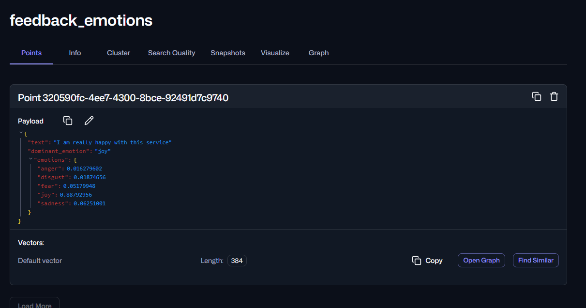

# Emotion detection system


## Intro
This project aims to create an AI web-based app that performs analytics on customer feedback. To accomplish this, I have created an Emotion Detection System that processes feedback provided by customers in text format and deciphers the emotions expressed.

In this project, I will use the embeddable Watson AI libraries to create an emotion detection application.

Emotion detection extends the concept of sentiment analysis by extracting finer emotions like joy, sadness, anger, and so on, from statements rather than just whether a statement is positive or negative. Emotion detection is widely used for AI based recommendation systems, chatbots, and so on.

## 1. Creating an emotion detection system using Watson NLP library
The Watson NLP libraries are embedded, so only need to send a post request to the correct function in the library and receive the output.
steps:
1. Create `emotion_detector` function in `emotion_detection.py` file
2. Define url, headers, and body and make post Request to emotion detection API
3. Convert response to a json object
4. Extract prediction from response
5. Detect dominant emotion & combine it with above dictionary to return

Example API response
```python
{
    "emotionPredictions":[
        {
            "emotion":{
                "anger":0.010043259, 
                "disgust":0.016082913, 
                "fear":0.051737938, 
                "joy":0.9262508, 
                "sadness":0.04585947
            }, 
            "target":"", 
            "emotionMentions":[
                {
                    "span":{
                        "begin":0, 
                        "end":36, 
                        "text":"This is a really interesting project"
                    }, 
                    "emotion":{
                        "anger":0.010043259, 
                        "disgust":0.016082913, 
                        "fear":0.051737938, 
                        "joy":0.9262508, 
                        "sadness":0.04585947
                    }
                }
            ]
        }
    ],
    "producerId":{
        "name":"Ensemble Aggregated Emotion Workflow", 
        "version":"0.0.1"
    }
}
```

### Testing function
* Open a python shell and import function
```pythoh
from emotion_detection import emotion_detector
```
* Use function
```python
emotion_detector("This is a really interesting project")
```

Example output:
```pyton
{'anger': 0.010043259, 'disgust': 0.016082913, 'fear': 0.051737938, 'joy': 0.9262508, 'sadness': 0.04585947, 'dominant_emotion': 'joy'}
```

## 2. Packaging the application
1. Create the `EmotionDetection` folder and place `emotion_detection.py` inside along with `__init__` file to reference the module.
2. Test the package by importing it in a python shell
```pyton
>>> from EmotionDetection.emotion_detection import emotion_detector
```
3. If no error show, it indicates the package is ready to use
```python
>>> emotion_detector("This is a really interesting course")
{'anger': 0.016279602, 'disgust': 0.01874656, 'fear': 0.05179948, 'joy': 0.88792956, 'sadness': 0.06251001, 'dominant_emotion': 'joy'}
>>> emotion_detector("I hate working long hours")
{'anger': 0.64949876, 'disgust': 0.03718168, 'fear': 0.05612277, 'joy': 0.00862553, 'sadness': 0.1955148, 'dominant_emotion': 'anger'}
```

## 3. Unit tests
1. Create `test_emotion_detection.py` test file and add a unit test to test `emotion_detector`.
2. Test the following statements
    * "Im glad this happened" = "joy"
    * "Im really angry hearing about this" = "anger"
    * "Im feeling so disgusted even just hearing about this" = "disgust"
    * "Im so sad about this" = "sadness"
    * "Im really afraid this will happen" = "fear"
3. Run file
```bash
$ python3.11 test_emotion_detection.py
.
----------------------------------------------------------------------
Ran 1 test in 0.706s

OK
```

## 4. Web deployment of the application using flask
1. `index.html` is a simple html file with a text area where the user enters the sentence to be analysed.
2. The user clicks the Run button which triggers a JavaScript function in `emotion.js`
3. `emotion.js` sends a GET request to our `emotionDetector` endpoint to get the result, then sets the result on the UI
4.  `server.py` file contains the default endpoint which renders `index.html` in `/templates` and an endpoint for calling the `emotion_detector`. This endpoint parses the text from the query parameters and formats and returns it for viewing on the UI
3. The server also contains the function to execute app and deploy on localhost:5000

Example output:


## 5. Incorporating Error handling
1. use `response.raise_for_status()` to automatically raise HTTPError for bad requests
2. If predictions or emotions are empty, return json with None values for predictions
3. Handle `HTTPError` (API responds with bad status eg 400) and `RequestException` (request itself fails before the API even responds eg. no internet connection, invalid url, timeout) errors by printing a useful message and returning the empty prediction json object.
4. In server, check if the response was ok and display a different message depending

UI output:


## 6. Running static code analysis on project
* Check the code as per the PEP8 guidlines by running static code analysis
* Normally, this should be done at the time od packaging and unit testing 
* Fix the items it mentions to increase score close to 10
* Install PyLint
```bash
python3.11 -m pip install PyLint
```
* Run PyLint
```bash
pylint server.py
```
example output
```bash
************* Module server
server.py:12:0: C0301: Line too long (299/100) (line-too-long)
server.py:20:0: C0304: Final newline missing (missing-final-newline)
server.py:1:0: C0114: Missing module docstring (missing-module-docstring)
server.py:7:0: C0116: Missing function or method docstring (missing-function-docstring)
server.py:8:4: C0103: Variable name "inputText" doesn't conform to snake_case naming style (invalid-name)
server.py:16:0: C0116: Missing function or method docstring (missing-function-docstring)

-----------------------------------
Your code has been rated at 5.38/10
```

## Dockerising the container
Docker allows you to package your app and its dependencies into a single container. This ensures your app runs consistently accross different environmentts, making it easy to deploy, share, and scale your app.

The Dockerfile describes the steps to build this container, including installing Python, required libraries, copying your code, and starting the Flask server. Once built, you can run your app anywhere Docker is available.

Docker Compose is like combining the docker build and docker run commands (with all their parameters) into a single configuration file. It lets you define how to build your image, set environment variables, map ports, and manage multiple containers—all in one place. Then you just run `docker-compose up` to build and start everything as described in the file.

### .dockerignore
* The `.dockerignore` file lists files and folders that should be excluded from the Docker build context. This keeps your Docker image smaller and prevents sensitive or unnecessary files (like virtual environments, editor settings, and cache files) from being added to the container.

### Dockerfile
1. Use `python:3.10-slim`, a lightweight version of python
2. Set workin dir inside continer
3. install requirements - `--no-cache-dir` prevents pip from storing downloaded packages in cache, keeping the image smaller
4. Document port 5000

#### Build the Docker image
`docker build -t emotion-detection-app .`

#### Run the container from Docker image
`docker run -p 5000:5000 emotion-detection-app`

### docker-compose.yml
1. Define version of docker compose file format - `3.8` is a commonly used modern version
2. Define emotion-detection service. A service is a containerized application managed by Docker Compose.
3. `build: .` tells Docker Compose to build the image for this service using the Dockerfile in the current directory.
Then use: docker-compose up --build
4. Map port 5000 on your computer (host) to port 5000 in the container.

#### Run the container with Docker Compose
* `docker-compose up` starts the container using the existing image if one exists (like if you build one from your image above ^)
* `docker-compose up --build` forces Docker Compose to rebuild the image before starting the container
* Your application will be accessible at http://localhost:5000.


## Setting up Qdrant


### What is Qdrant
Qdrant is an open-source vector database desinged for efficient storage and searching of vector embeddings. In this project, it’s used to store customer feedback as vector embeddings and enable semantic search over stored feedback.

### Qdrant set up in Docker Compose
* qdrant service runs the Qdrant database in a container exposing port 6333 for API access
* The `qdrant_data` volume persists Qdrant's data on your machine so your db isnt lost when you stop or restart the container.
    * Docker volumes are special folders managed by docker.
    * The line `- qdrant_data:/qdrant/storage` means all data written to this volume when the container is running will also be saved to your machine
* Running `docker-compose up` runs both of the containers on the same network so they can communicate

### Quadrant integration in code
#### server.py
* Add two new endpoints for interacting with the database:
    * `/api/analyse_and_store`: 
        * POST endpoint for storing entries into the database.
        * Extracts body from request, calls emotion_detector then stores results in database
        * returns text and emotion detection result
    * `search_feedback_endpoint`: 
        * GET endpoint for semantic searching over database
        * Extracts query from url and sends to `embeddings.py` to search the database
        * returns similarity results

#### embeddings.py
* Connect to Qdrant using the docker-compose service name (`qdrant`) on port 6333
* Ensure the feedback collection exists, and if not create it with the correct size and similarity metric
* Embed text using the `SentenceTransformerModel` to convert the feedback to a vector embedding
* Store feedback and metadata in Qdrant. 
    * The embedded text plus metadata (the emotion detection result) are stored in the database as a point using the upsert function.
    * The upsert function "updates or inserts" one or many points into the db. if a point with that id exists, it will update it, otherwise, it will create a new one.
    * A point is a single entry into the database and it must have a unique id. I generated one with the `uuid4()`
    * The metadata is stored as the payload. This does not affect the embedding or similarity search.
* Similarity search on a piece of text:
    *  Create embedding for text
    * Query quadrant passing it the query vector, the ammount of results you want, whether or not you want the payload that contains the emotino detection results, and whether or not you want the actual vector.
    * format results by extracting id, similarity (score) and payload and return matches.
    * The higher the score, the more similar the vector

### Usage
#### Docker
* To run both of the containers from existing images:
    ```bash
    docker-compose up
    ```
* to seperately run the images:
    ```bash
    docker run -p 6333:6333 qdrant/qdrant
    docker build -t emotion-detection-app .
    ```
* To rebuild both of the images and then run the containers:
    ```bash
    docker-compose up --build
    ```
* To run containers seperately by service name:
    ```bash
    docker-compose up qdrant
    ```
* To run a app in the foreground (useful for debugging):
    ```bash
    docker-compose run --service-ports emotion-detection
    ```

##### Debugging in Docker
* To debug the python file, run it in the foreground then add `breakpoint()` statements in the code whereever you want to add a break point
* Trigger the code to hit the breakpoint eg. by hitting an endpoint
* This will open the python debugger. you will see `(Pdb)` in your command line and you can type commands to interact with the debugger.
    * n — step to the next line
    * c — continue execution until the next breakpoint
    * l — list source code around the current line
    * p variable_name — print the value of a variable (e.g., p text)
    * s - step into 
    * q — quit the debugger
* The debugger will print the code to console so you can keep track of the current line, for example:
    ```python
        (Pdb) l
    64         """
    65         Semantic search over stored feedback using Qdrant.
    66         Returns a list of payloads with text + emotions.
    67         """
    68         breakpoint()
    69  ->     ensure_collection()
    70         query_vec = embed_text(query)
    71
    72         hits = qdrant.search(
    73             collection_name=COLLECTION_NAME,
    74             query_vector=query_vec,
    ```
#### Endpoints
##### /api/analyse_and_store
* Send POST request with the text in json format to store it in the database:
    ```bash
    curl -X POST http://localhost:5000/api/analyse_and_store -H "Content-Type: application/json" -d "{\"text\": \"I am really happy with this service\"}"
    ```
* result:
    ```bash
    {
    "analysis": {
        "anger": 0.016279602,
        "disgust": 0.01874656,
        "dominant_emotion": "joy",
        "fear": 0.05179948,
        "joy": 0.88792956,
        "sadness": 0.06251001
    },
    "text": "I am really happy with this service"
    }
    ```
##### /api/search_feedback
* Send GET request with the string you want to do a similarity search for:
    ```bash
    curl -X GET "http://localhost:5000/api/search_feedback?query=I%20am%20so%20angry%20"
    ```
    > Note: quotes and "%20" for space encoding are important
* result:
    ```bash
    [ScoredPoint(id='ffc30a96-0a9c-4b0c-bdfa-ca13a99013ed', version=4, score=0.9999999, payload={'text': 'I am so angry', 'dominant_emotion': 'anger', 'emotions': {'anger': 0.85, 'disgust': 0.05, 'fear': 0.05, 'joy': 0.01, 'sadness': 0.04}}, vector=None, shard_key=None, order_value=None), ScoredPoint(id='66d96be4-4456-4a66-8e95-61fbabeaa1d0', version=3, score=0.4017858, payload={'text': 'I am really happy', 'dominant_emotion': 'joy', 'emotions': {'anger': 0.016279602, 'disgust': 0.01874656, 'fear': 0.05179948, 'joy': 0.88792956, 'sadness': 0.06251001}}, vector=None, shard_key=None, order_value=None), ScoredPoint(id='a94a6d7e-c54e-4db5-9310-e5697fde1646', version=2, score=0.31094876, payload={'text': 'I am really happy with this', 'dominant_emotion': 'joy', 'emotions': {'anger': 0.016279602, 'disgust': 0.01874656, 'fear': 0.05179948, 'joy': 0.88792956, 'sadness': 0.06251001}}, vector=None, shard_key=None, order_value=None)]
    ```
* Notice when I search for "I am so angry" which is already in the database, we get back the encoding with that text which has almost a perfect score as the top result


