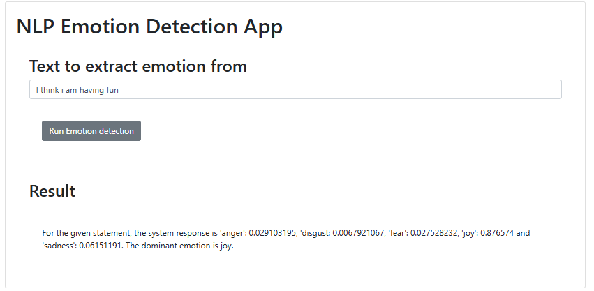
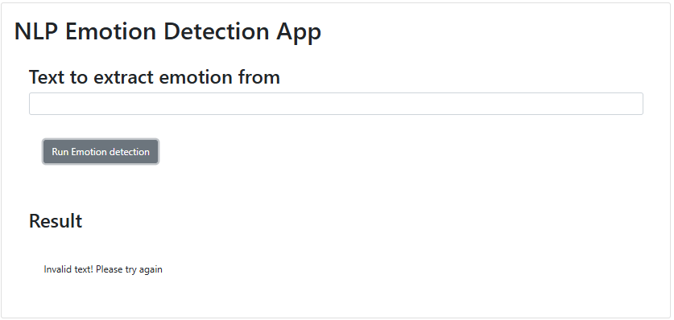
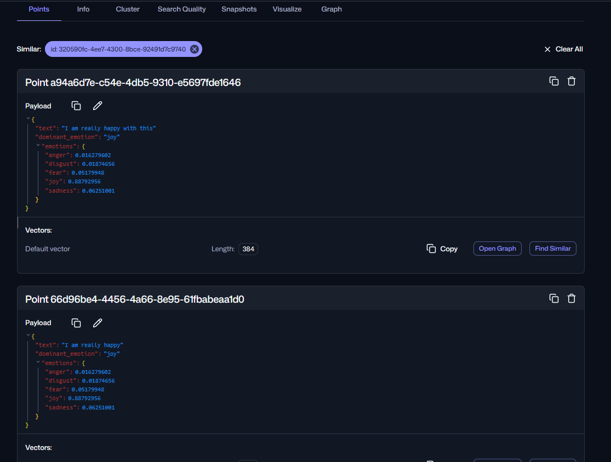

# Emotion Detection System
AI-Powered Emotion Analysis, Agentic LLM Workflow & Vector Search (Flask • Watson NLP • SentenceTransformers • Qdrant • OpenAI • Docker)


## 🚀 Project Overview
This project is a fully containerised, production-ready AI microservice deployed to AWS ECS Fargate, combining advanced NLP, vector search, and agentic automation:

* **Emotion Detection:** Accurately identifies fine-grained emotions (joy, anger, sadness, disgust, fear) from customer feedback using Watson NLP.
* **Semantic Search:** Embeds feedback with SentenceTransformers and stores it in Qdrant, enabling fast, context-aware similarity search.
* **Agentic LLM Workflow:** Integrates OpenAI’s GPT-4 to generate empathetic, context-rich support replies—leveraging both emotion analysis and retrieval-augmented generation.
* **Streaming LLM responses:** Supports real time token streaming from GPT-4o-mini which displays text to client while it is being generated.
* **Microservice Architecture:** Exposes a robust REST API via Flask, supporting analysis, storage, semantic search, and agentic reply generation.
* **Cloud Deployment**: Runs locally via Docker Compose and deployed to AWS ECS Fargate for production-style container orchestration

**Key Skills Demonstrated:**
* Advanced **NLP** and **LLM integration**
* Retrieval-augmented generation (RAG) and agentic workflows
* **Vector database** design and semantic search
* **API engineering** and **error handling**
* **Dockerised** microservices and scalable deployment
* Automated **testing**, static analysis, and debugging inside containers
* Cloud-native deployment with AWS ECS Fargate and ECR

This project showcases practical, production-grade AI engineering—ideal for real-world customer support, workflow automation, and modern AI product development.

## 🛠 Tech Stack
* **Backend**: Python, Flask
* **AI/NLP**: Watson NLP, SentenceTransformers, **OpenAI GPT-4 (LLM)**
* **Vector DB**: Qdrant (Dockerised)
* **Search**: Cosine similarity
* **Agentic Workflow**: lightweight Retrieval-augmented generation (RAG) style with LLM
* **DevOps**: Docker, Docker Compose, Pylint
* **Frontend**: HTML, JavaScript (basic UI)

---

## ⚡ Quickstart (Docker — recommended)
```bash
docker-compose up --build
```
* App → http://localhost:5000
* Qdrant Dashboard → http://localhost:6333

Stops everything:
```bash
docker-compose down
```
> Note: make sure to add your OPENAI_API_KEY to your environment variables

---

## 🧠 Architecture Overview
```
            +-----------------+
            |   User Input    |
            +--------+--------+
                     |
                     v
         +-----------+-----------+
         |   Flask REST API      |
         +-----------+-----------+
                     |
         +-----------+-----------+
         | Watson NLP (Emotions) |
         +-----------+-----------+
                     |
         +-----------+-----------+
         | SentenceTransformer   |
         |   Embeddings          |
         +-----------+-----------+
                     |
   +-----------------+-------------------+
   |           Qdrant Vector DB          |
   | (store + semantic search + metadata)|
   +-----------------+-------------------+
                     |
                     v
          +----------+-----------+
          |  LLM Agent (GPT-4o)  |
          +----------+-----------+
                     |
                     v
         +-----------+------------+
         | JSON Response to User  |
         +-------------------------+
```

**Components:**
* **server.py** – Flask API (analysis, storage, semantic search, health, count)
* **emotion_detection.py** – Watson NLP integration
* **embeddings.py** – embedding + Qdrant client + similarity search + count
* **agent.py** - LLM agent (GPT-4o-mini) that can stream potential responses to a users sentiment
* **docker-compose.yml** – Orchestrates Flask + Qdrant services
* **Qdrant Dashboard** – Real-time inspection of vectors & payloads

---

## 📡 API Endpoints
**POST /api/analyse_and_store**

Analyse text + store in Qdrant.
```bash
curl -X POST http://localhost:5000/api/analyse_and_store \
-H "Content-Type: application/json" \
-d "{\"text\": \"I am really happy with this service\"}"
```
Response:
```bash
{
  "text": "I am really happy with this service",
  "analysis": {
    "anger": 0.016,
    "disgust": 0.018,
    "fear": 0.052,
    "joy": 0.888,
    "sadness": 0.062,
    "dominant_emotion": "joy"
  }
}
```

---

**GET /api/search_feedback?query=…**

Semantic search using vector similarity.
```bash
curl "http://localhost:5000/api/search_feedback?query=I%20am%20so%20angry"
```
Returns closest matches with similarity scores + emotions.

---

**GET /status**

Simple health check.
```bash
{"status": "ok"}
```

---

**GET /count**

Returns number of stored feedback items.

---

**POST /api/suggest_reply**
Agent Endpoint to get suggested reponse to customer feedback
```bash
curl -X POST http://localhost:5000/api/suggest_reply -H "Content-Type: application/json" -d "{\"text\": \"I am really angry about this\"}"
```
Response:
```bash
{
  "input_feedback": "I am really angry about this",
  "detected_emotion": {
    "anger": 0.82,
    "fear": 0.04,
    "joy": 0.01,
    "sadness": 0.07,
    "disgust": 0.06,
    "dominant_emotion": "anger"
  },
  "similar_feedback": [...],
  "suggested_reply": "I'm sorry to hear this..."
}
```

**POST /api/suggest_reply_stream**
Streams LLM response chunk-by-chunk as plain text.
```bash
curl -N -X POST http://localhost:5000/api/suggest_reply_stream -H "Content-Type: application/json" -d "{\"text\": \"I am really angry about this\"}"
```
> **Note:** `-N` disables curl's buffering so you can see stream in real time.

---

## 🧬 Emotion Detection (Watson NLP)
1. Calls Watson NLP API
2. Extracts emotion probabilities
3. Identifies dominant emotion
4. Returns a structured JSON response

Example output:
```bash
{
 "anger": 0.01,
 "disgust": 0.02,
 "fear": 0.05,
 "joy": 0.93,
 "sadness": 0.04,
 "dominant_emotion": "joy"
}
```

---

## 🔍 Semantic Search (Qdrant + Embeddings)
### Why Qdrant?
Qdrant is a purpose-built vector database designed for fast similarity search.

### How storing works
* Convert text → vector (SentenceTransformer)
* Generate unique ID (uuid4)
* Store vector + metadata payload in Qdrant
* Payload includes both:
    * the raw text
    * the Watson emotion scores

### How searching works
* Convert query → vector
* Perform cosine similarity search
* Retrieve top-k matches with payloads

This enables “find similar feedback” based purely on semantics.

## 🤖 Agent Workflow (LLM-Powered Suggested Reply Generator)
The AI agent workflow combines multiple tools — emotion detection, vector retrieval, and an LLM — to generate helpful, human-like suggested replies to customer feedback.

This endpoint demonstrates real agentic behaviour:
```bash
Tool → Tool → Retrieval → LLM → Structured Output
```

### What the Agent Does
When you call /api/suggest_reply, the system performs a full multi-step pipeline:
1. Detects emotions
2. Retrieves similar feedback
3. Constructs system prompt and a user prompt with context (original text, emotion analysis, similar examples, metadata from vector DB)
4. Calls an LLM (OpenAI's gpt-4o-mini) to generate a short, empathetic, support-style message.
5. Returns structured JSON

Useful for downstream automations or UI handling.

This mirrors the architecture used in real workflow automation platforms (LangGraph, n8n, Zapier + LLMs, custom agent frameworks).

Agent diagram:
```
User Text
   ↓
Watson NLP (emotion detection)
   ↓
SentenceTransformer Embedding
   ↓
Qdrant Vector Search (similar items)
   ↓
LLM (GPT-4o-mini) — generates suggested reply
   ↓
Structured JSON Response
```

---

## ⏱️Realtime Streaming
This project supports **token-by-token streaming** from GPT-4o-mini using Flask generators (yield) and the OpenAI streaming API. This enables real-time UI updates (gives the typing effect you see in ChatGPT).

**Why it matters:**
* User gets results faster
* Required for chat-style interfaces
* Mirrors production-grade applications

---


## 🐳 Dockerisation
### Dockerfile
* Python 3.10-slim
* Install dependencies
* Copy source code
* Expose port 5000
* Run Flask server

## docker-compose.yml
Defines two services:
```yaml
services:
  emotion-detection:  # Flask API
  qdrant:             # Vector database
```
* Shared Docker network
* Persistent volume (qdrant_data)
* Automatic rebuild/run using one command

---

## ☁️ Cloud Deployment: AWS ECS Fargate
This service is deployed to **AWS ECS using Fargate** to demonstrate a production-style container deployment without managing underlying servers.

**Why ECS Fargate was chosen:**
- **Serverless container execution** - no EC2 instances or OS management required
- **Easy scaling** by setting task count
-  **Health management** handled by AWS.
- **Clear separation of concerns** between application code and infrastructure
- **Commonly used in production AI and backend systems**

This mirrors how many teams deploy Python-based AI services in real-world environments.

### Deployment highlights:
- Built and pushed Docker image to **Amazon ECR**
- Created ECS **Task Definition** with environment variables injected via the task definition
- Deployed as a **Fargate service** with public networking
- Configured **Security Groups** to expose the API on port 5000
- Injected sensitive configuration (OpenAI API key) via environment variables
- Verified deployment via live /health and API endpoints

### Live Access
The service runs as a publicly accessible ECS task (IP-based access): http://13.60.202.71:5000

> Note: In production, this would typically sit behind an Application Load Balancer (ALB).  
> This deployment focuses on ECS fundamentals, container orchestration, and cloud networking.

### Why this matters
This deployment mirrors how production AI services are run:
- Long-running API services (not scripts)
- Cloud-native container execution
- Secure secret handling
- Infrastructure-aware AI engineering

### Why ECS Fargate
- Serverless containers: no EC2/cluster management required.
- Simple scaling: adjust desired task count; ALB/VPC integration.
- Security by design: IAM roles for tasks and isolated ENIs.
- Cost focus: pay per vCPU/memory; no idle hosts to manage.
- Clean workflow: push to ECR and deploy without managing nodes.

---

## 🧪 Testing & Code Quality
### Unit Tests
Located in `test_emotion_detection.py`.

Run:
```bash
python -m unittest
```

### Static Analysis (Pylint)
Run:
```bash
pylint server.py
```

---

## 🖥 Debugging (with Docker)
Run app service in foreground:
```bash
docker-compose run --service-ports emotion-detection
```
Use `breakpoint()` anywhere inside the code to open Python debugger in the terminal.

## 📷 UI Preview
Main App:


Error Handling Example:



Qdrant Similarity Matches:



---

## 🎯 Summary
This project demonstrates:
* Advanced NLP with Watson and vector embeddings
* Qdrant integration and semantic search
* Retrieval-augmented generation (RAG) and agentic LLM workflows
* OpenAI GPT-4 integration for empathetic, context-aware replies
* Real-time streaming of responses from LLM
* Clean REST API design and robust error handling
* Dockerised microservices for scalable deployment
* Unit testing, static analysis, and in-container debugging
